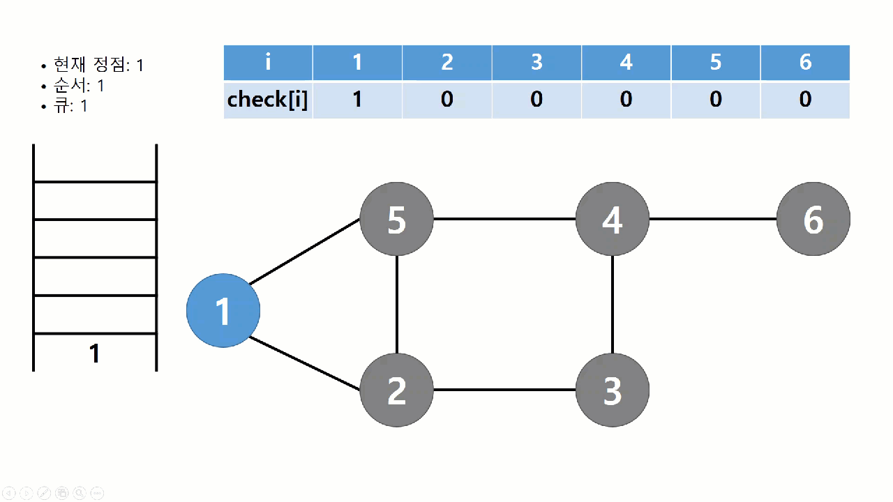

# BFS(Breadth-First Search, 넓이 우선 탐색)

## BFS란?
> BFS는 그래프 전체를 탐색하는 방법 중 하나로써 루트 노드에서 시작해서 인접한 노드를 먼저 탐색하는 방법니다.

## BFS의 특징
- 직관적이지 않은 면이 있다.
    - BFS는 시작 노드에서 시작해서 거리에 따라 단계별로 탐색한다고 볼 수 있다.
- BFS는 재귀적으로 동작하지 않는다.
- 이 알고리즘을 구현할 때 가장 큰 차이점은, 그래프 탐색의 경우 **어떤 노드를 방문했었는지 여부를 반드시 검사** 해야 한다는 것이다.
    - 그렇지 않으면 무한루프에 빠질 위험이 있다.
- 방문한 노드들을 차례로 저장한 후 꺼낼 수 있는 자료 구조인 큐(Queue)를 사용한다.
    - 즉, 선입선출(FIFO) 원칙으로 탐색
    - 일반적으로 큐를 이용해서 반복적 형태로 구현하는 것이 가장 잘 동작한다.

## BFS의 과정
<center></center>

- 시작 노드로부터 깊이가 동일한 모든 노드들을 방문한 뒤에 다음 깊이의 노드들을 차례로 방문한다.
    - 깊이 1 -> 깊이 2 -> 깊이 3 ...
- 노드들을 방문 하다 더 이상 방문할 곳이 없으면 종료한다.

## BFS의 구현
### Queue
```
void search(Node root) {
  Queue queue = new Queue();
  root.marked = true;
  queue.enqueue(root);

  while (!queue.isEmpty()) {
    Node r = queue.dequeue();
    visit(r);
    foreach (Node n in r.adjacent) {
      if (n.marked == false) {
        n.marked = true;
        queue.enqueue(n);
      }
    }
  }
}
```

## BFS의 시간 복잡도
>- 인접 리스트로 표현된 그래프: O(N+E)
>- 인접 행렬로 표현된 그래프: O(N^2)
>
> 깊이 우선 탐색과 마찬가지로 그래프 내에 적은 숫자의 간선만을 가지는 희소그래프(Sparse Graph)의 경우 인접 행렬보다 인접 리스트를 사용하는 것이 유리하다.

#### Reference
- [[알고리즘] 너비 우선 탐색(BFS)이란](https://gmlwjd9405.github.io/2018/08/15/algorithm-bfs.html)
- [너비 우선 탐색(BFS)](https://velog.io/@polynomeer/%EB%84%88%EB%B9%84-%EC%9A%B0%EC%84%A0-%ED%83%90%EC%83%89BFS)