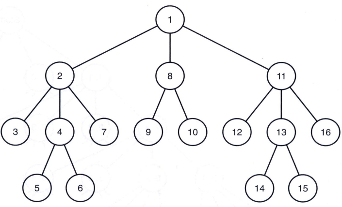

# DFS(Depth-First Search, 깊이 우선 탐색)

## DFS란?
> DFS는 그래프 전체를 탐색하는 방법 중 하나로써 시작점 부터 다음 분기로 넘어가기 전에 해당 분기를 완벽하게 탐색하고 넘어가는 방법이다.

## DFS의 특징
- 자기 자신을 호출하는 순환 알고리즘의 형태를 가지고 있다.
- 전위 순회(Pre-Order Traversals)를 포함한 다른 형태의 트리 순회는 모두 DFS의 한 종류이다.
- 이 알고리즘을 구현할 때 가장 큰 차이점은, 그래프 탐색의 경우 **어떤 노드를 방문했었는지 여부를 반드시 검사** 해야 한다는 것이다.
- 이를 검사하지 않을 경우 무한루프에 빠질 위험이 있다.

## DFS의 과정
<center></center>

- a 노드(시작 노드)를 방문한다.
    - 방문한 노드는 방문했다고 표시한다.
- a와 인접한 노드들을 차례로 순회한다.
    - a와 인접한 노드가 없다면 종료한다.
- a와 이웃한 노드 b를 방문했다면, a와 인접한 또 다른 노드를 방문하기 전에 b의 이웃 노드들을 전부 방문해야 한다.
    - b를 시작 정점으로 DFS를 다시 시작하여 b의 이웃 노드들을 방문한다.
- b의 분기를 전부 완벽하게 탐색했다면 다시 a에 인접한 정점들 중에서 아직 방문이 안 된 정점을 찾는다.
    - 즉, b의 분기를 전부 완벽하게 탐색한 뒤에야 a의 다른 이웃 노드를 방문할 수 있다는 뜻이다.
    - 아직 방문이 안 된 정점이 없으면 종료한다.
    - 있으면 다시 그 정점을 시작 정점으로 DFS를 시작한다.

## DFS의 구현

### 재귀 호출
```
void depth_first_tree_search (node v) {
    node u;
    visit v;
    for (each child u of v)
        depth_first_tree_search(u)
}

```

### Stack
```
void depth_first_search_stack (){
    node u;
    visit v;
    stack st;
    st.push(u);
    while (queue is not empty)
        node u2 = st.pop();
        if (each child u2 of v)
            st.push(u2)
        else
            print(u2)
}
```

## DFS의 시간 복잡도
>DFS는 그래프(정점의 수: N, 간선의 수: E)의 모든 간선을 조회한다.
>- 인접 리스트로 표현된 그래프: O(N+E)
>- 인접 행렬로 표현된 그래프: O(N^2)
>
>즉, 그래프 내에 적은 숫자의 간선만을 가지는 희소 그래프(Sparse Graph)의 경우 인접 행렬보다 인접 리스트를 사용하는 것이 유리하다.

#### Reference
- [[알고리즘] 깊이 우선 탐색(DFS)이란](https://gmlwjd9405.github.io/2018/08/14/algorithm-dfs.html)